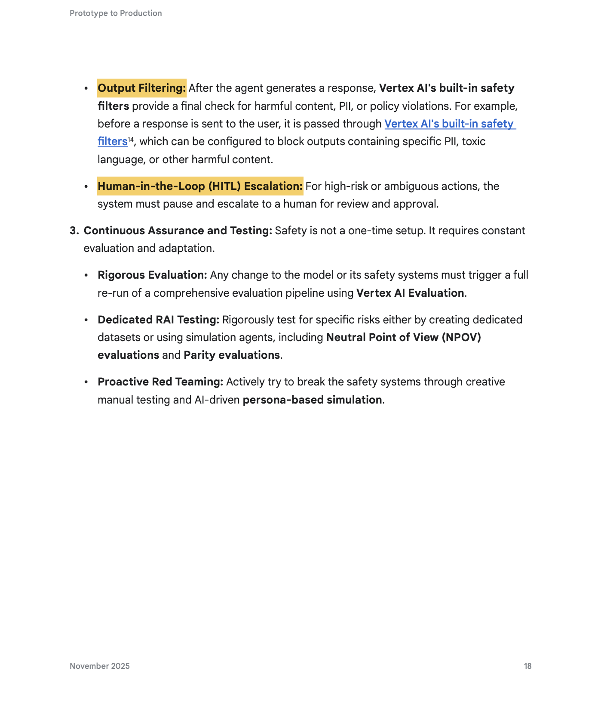
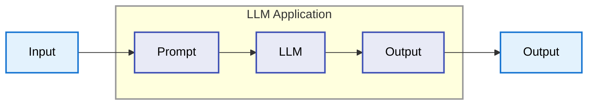
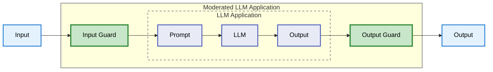

## Como evitar que el LLM se vaya a la banquina

Julian Pasquale

---
layout: image
image: ./images/background.png
backgroundSize: 50em 90%
---

---

# El Problema con los LLM

<div class="grid gap-6">

<v-click>

### Modelos estadísticos, no determinísticos

```python
prompt = "Suma 2 + 2"

response_1 = llm(prompt) # "4"
response_2 = llm(prompt) # "2 + 2 = 4"
response_3 = llm(prompt) # "La suma es cuatro"
```
</v-click>
<v-click>

### No es confiable
- Información desactualizada
- Responder a preguntas que no queremos
- Información erronea o contradictoria

</v-click>
</div>

---
layout: image-right
image: ./images/hallucination_meme.png
backgroundSize: 20em 70%
---

# Hallucinations

Cuando el modelo genera contenido que:
- No es factualmente correcto
- Inventa referencias o datos
- Contradice la información proporcionada
- Parece confiable pero es falso

<div class="mt-6">

Inherente a la arquitectura de los LLMs

</div>

---

# Tasas de Alucinación
Benchmarks según Vectara Hallucination Leaderboard (Diciembre 2025) - Metodología HHEM-2.3

<div style="font-size: 9px; margin-top: 20px;">

<div style="display: flex; align-items: center; margin-bottom: 6px;">
  <div style="width: 150px;" class="text-sm">Gemini-2.5-Flash-Lite</div>
  <div style="flex: 1; background: #e0e0e0; height: 20px; border-radius: 2px;">
    <div style="width: 25.4%; background: #4caf50; height: 100%; border-radius: 2px; display: flex; align-items: center; justify-content: flex-end; padding-right: 6px; color: white; font-weight: 700;">3.3%</div>
  </div>
</div>

<div style="display: flex; align-items: center; margin-bottom: 6px;">
  <div style="width: 150px;" class="text-sm">DeepSeek-V3.2-Exp</div>
  <div style="flex: 1; background: #e0e0e0; height: 20px; border-radius: 2px;">
    <div style="width: 40.8%; background: #2196f3; height: 100%; border-radius: 2px; display: flex; align-items: center; justify-content: flex-end; padding-right: 6px; color: white; font-weight: 700;">5.3%</div>
  </div>
</div>

<div style="display: flex; align-items: center; margin-bottom: 6px;">
  <div style="width: 150px;" class="text-sm">DeepSeek-V3.1</div>
  <div style="flex: 1; background: #e0e0e0; height: 20px; border-radius: 2px;">
    <div style="width: 42.3%; background: #2196f3; height: 100%; border-radius: 2px; display: flex; align-items: center; justify-content: flex-end; padding-right: 6px; color: white; font-weight: 700;">5.5%</div>
  </div>
</div>

<div style="display: flex; align-items: center; margin-bottom: 6px;">
  <div style="width: 150px;" class="text-sm">GPT-4.1</div>
  <div style="flex: 1; background: #e0e0e0; height: 20px; border-radius: 2px;">
    <div style="width: 43.1%; background: #9c27b0; height: 100%; border-radius: 2px; display: flex; align-items: center; justify-content: flex-end; padding-right: 6px; color: white; font-weight: 700;">5.6%</div>
  </div>
</div>

<div style="display: flex; align-items: center; margin-bottom: 6px;">
  <div style="width: 150px;" class="text-sm">DeepSeek-V3</div>
  <div style="flex: 1; background: #e0e0e0; height: 20px; border-radius: 2px;">
    <div style="width: 47.0%; background: #2196f3; height: 100%; border-radius: 2px; display: flex; align-items: center; justify-content: flex-end; padding-right: 6px; color: white; font-weight: 700;">6.1%</div>
  </div>
</div>

<div style="display: flex; align-items: center; margin-bottom: 6px;">
  <div style="width: 150px;" class="text-sm">Gemini-2.5-Pro</div>
  <div style="flex: 1; background: #e0e0e0; height: 20px; border-radius: 2px;">
    <div style="width: 53.8%; background: #4caf50; height: 100%; border-radius: 2px; display: flex; align-items: center; justify-content: flex-end; padding-right: 6px; color: white; font-weight: 700;">7.0%</div>
  </div>
</div>

<div style="display: flex; align-items: center; margin-bottom: 6px;">
  <div style="width: 150px;" class="text-sm">Gemini-2.5-Flash</div>
  <div style="flex: 1; background: #e0e0e0; height: 20px; border-radius: 2px;">
    <div style="width: 60.0%; background: #4caf50; height: 100%; border-radius: 2px; display: flex; align-items: center; justify-content: flex-end; padding-right: 6px; color: white; font-weight: 700;">7.8%</div>
  </div>
</div>

<div style="display: flex; align-items: center; margin-bottom: 6px;">
  <div style="width: 150px;" class="text-sm">GPT-4o</div>
  <div style="flex: 1; background: #e0e0e0; height: 20px; border-radius: 2px;">
    <div style="width: 73.8%; background: #9c27b0; height: 100%; border-radius: 2px; display: flex; align-items: center; justify-content: flex-end; padding-right: 6px; color: white; font-weight: 700;">9.6%</div>
  </div>
</div>

<div style="display: flex; align-items: center; margin-bottom: 6px;">
  <div style="width: 150px;" class="text-sm">Claude-Haiku-4.5</div>
  <div style="flex: 1; background: #e0e0e0; height: 20px; border-radius: 2px;">
    <div style="width: 75.4%; background: #ff9800; height: 100%; border-radius: 2px; display: flex; align-items: center; justify-content: flex-end; padding-right: 6px; color: white; font-weight: 700;">9.8%</div>
  </div>
</div>

<div style="display: flex; align-items: center; margin-bottom: 6px;">
  <div style="width: 150px;" class="text-sm">Claude-Sonnet-4</div>
  <div style="flex: 1; background: #e0e0e0; height: 20px; border-radius: 2px;">
    <div style="width: 79.2%; background: #ff9800; height: 100%; border-radius: 2px; display: flex; align-items: center; justify-content: flex-end; padding-right: 6px; color: white; font-weight: 700;">10.3%</div>
  </div>
</div>

<div style="display: flex; align-items: center; margin-bottom: 6px;">
  <div style="width: 150px;" class="text-sm">GPT-5-Nano</div>
  <div style="flex: 1; background: #e0e0e0; height: 20px; border-radius: 2px;">
    <div style="width: 80.8%; background: #9c27b0; height: 100%; border-radius: 2px; display: flex; align-items: center; justify-content: flex-end; padding-right: 6px; color: white; font-weight: 700;">10.5%</div>
  </div>
</div>

<div style="display: flex; align-items: center; margin-bottom: 6px;">
  <div style="width: 150px;" class="text-sm">Claude-Opus-4.5</div>
  <div style="flex: 1; background: #e0e0e0; height: 20px; border-radius: 2px;">
    <div style="width: 83.8%; background: #ff9800; height: 100%; border-radius: 2px; display: flex; align-items: center; justify-content: flex-end; padding-right: 6px; color: white; font-weight: 700;">10.9%</div>
  </div>
</div>

<div style="display: flex; align-items: center; margin-bottom: 6px;">
  <div style="width: 150px;" class="text-sm">GPT-5.1-Low</div>
  <div style="flex: 1; background: #e0e0e0; height: 20px; border-radius: 2px;">
    <div style="width: 83.8%; background: #9c27b0; height: 100%; border-radius: 2px; display: flex; align-items: center; justify-content: flex-end; padding-right: 6px; color: white; font-weight: 700;">10.9%</div>
  </div>
</div>

<div style="display: flex; align-items: center; margin-bottom: 6px;">
  <div style="width: 150px;" class="text-sm">DeepSeek-R1</div>
  <div style="flex: 1; background: #e0e0e0; height: 20px; border-radius: 2px;">
    <div style="width: 87.0%; background: #2196f3; height: 100%; border-radius: 2px; display: flex; align-items: center; justify-content: flex-end; padding-right: 6px; color: white; font-weight: 700;">11.3%</div>
  </div>
</div>

<div style="display: flex; align-items: center; margin-bottom: 6px;">
  <div style="width: 150px;" class="text-sm">GPT-5.1-High</div>
  <div style="flex: 1; background: #e0e0e0; height: 20px; border-radius: 2px;">
    <div style="width: 93.1%; background: #9c27b0; height: 100%; border-radius: 2px; display: flex; align-items: center; justify-content: flex-end; padding-right: 6px; color: white; font-weight: 700;">12.1%</div>
  </div>
</div>

<div style="display: flex; align-items: center; margin-bottom: 6px;">
  <div style="width: 150px;" class="text-sm">GPT-5-Mini</div>
  <div style="flex: 1; background: #e0e0e0; height: 20px; border-radius: 2px;">
    <div style="width: 99.2%; background: #9c27b0; height: 100%; border-radius: 2px; display: flex; align-items: center; justify-content: flex-end; padding-right: 6px; color: white; font-weight: 700;">12.9%</div>
  </div>
</div>

</div>

---
layout: center
class: text-center
---

# ¿Por qué no basta con Prompt Engineering?

---
layout: two-cols-header
---

# Google - Prototype to Production

::left::


::right::


---
layout: image-right
image: ./images/prompt_injection_meme.png
backgroundSize: 45em 80%
---

# 🔓 OWASP LLM01:2025
## Prompt Injection

<blockquote cite="https://genai.owasp.org/llmrisk/llm01-prompt-injection/" class="mt-6">
  Prompt Injection vulnerabilities exist in how models process prompts, and how input may force the model to incorrectly pass prompt data to other parts of the model, potentially causing them to violate guidelines, generate harmful content, enable unauthorized access, or influence critical decisions. While techniques like Retrieval Augmented Generation (RAG) and fine-tuning aim to make LLM outputs more relevant and accurate, research shows that they do not fully mitigate prompt injection vulnerabilities.
</blockquote>

<blockquote cite="https://genai.owasp.org/llmrisk/llm01-prompt-injection/" class="mt-6">
  Prompt injection vulnerabilities are possible due to the nature of generative AI. Given the stochastic influence at the heart of the way models work, it is unclear if there are fool-proof methods of prevention for prompt injection
</blockquote>

---

# ¿Qué son los Guardrails?

<div>

Capas de **validación, filtrado y control** alrededor del LLM.

- ✅ **Validar** entradas antes del procesamiento
- ✅ **Filtrar** salidas antes de entregarlas al usuario
- ✅ **Detectar** contenido problemático
- ✅ **Ofuscar** información sensible (PII)
- ✅ **Verificar** adherencia a políticas
- ✅ **Monitorear** comportamiento en producción

</div>

<v-click>

<div class="mt-6 p-4 bg-blue-50 dark:bg-blue-900/20 rounded">
💡 No confiar en UNA sola capa de defensa
</div>

</v-click>

---

# Arquitectura de LLM con Guardrails

<div class='grid gap-12 mt-12'>
<v-click>
<div>

## Sin Guardrails



</div>
</v-click>

<v-click>
<div>

## Con Guardrails



</div>
</v-click>
</div>

---

# Layers

<div class="grid grid-cols-2 gap-4">
<div>

## 1️⃣ Input Layer

<div class="text-sm">

- **Sanitización** de caracteres especiales
- **Detección de PII** (datos personales)
- **Anti-injection patterns**
- **Topic validation** (temas prohibidos)
- **Rate limiting** por usuario

</div>
</div>

<div>
<v-click>

## 2️⃣ Processing Layer

<div class="text-sm">

- **Context management** (límites de ventana)
- **Policy enforcement** (reglas de negocio)
- **Token budgets** (límites de costo)
- **Retrieval filtering** (en RAG)

</div>
</v-click>
</div>


<div>
<v-click>

## 3️⃣ Output Layer

<div class="text-sm">

- **Hallucination detection**
- **PII redaction** (eliminar datos sensibles)
- **Bias detection** (fairness)
- **Completeness checks**

</div>
</v-click>
</div>

<div>
<v-click>

## 4️⃣ Monitoring Layer

<div class="text-sm">

- **Audit logging** (trazabilidad)
- **Anomaly detection** (patrones sospechosos)
- **Performance metrics**
- **Cost tracking**
- **Human-in-the-loop** para casos edge

</div>
</v-click>
</div>

</div>

---
layout: image
image: ./images/chapulin.png
backgroundSize: 20em 50%
---

---
layout: two-cols-header
class: text-sm
---

# OpenAI: Moderation API

::left::

```json
{
  "id": "modr-970d409ef3bef3b70c73d8232df86e7d",
  "model": "omni-moderation-latest",
  "results": [
    {
      "flagged": true,
      "categories": {
        "sexual": false,
        "hate": false,
        "violence": true,
      },
      "category_scores": {
        "sexual": 2.34135824776394e-7,
        "hate": 3.1999824407395835e-7,
        "violence": 0.8599265510337075,
      },
      "category_applied_input_types": {
        "sexual": ["image"],
        "hate": [],
        "violence": ["image"],
      }
    }
  ]
}
```

::right::

<div class="ml-12">

### Categorías

- sexual
- sexual/minors
- harassment
- harassment/threatening
- hate
- hate/threatening
- illicit
- illicit/violent
- self-harm
- self-harm/intent
- self-harm/instructions
- violence
- violence/graphic

</div>


---
layout: image-right
image: ./images/gemini_safety_filters.png
backgroundSize: 30em 70%
---

# Google Gemini: Safety Settings

## Blocking Thresholds

5 niveles de configuración:

```python {text:xs}
BLOCK_NONE           # Permitir todo
BLOCK_ONLY_HIGH      # Solo alta probabilidad
BLOCK_MEDIUM_AND_ABOVE  # Media + alta
BLOCK_LOW_AND_ABOVE  # Baja + media + alta
OFF                  # Deshabilitado
```

<style>
  image {
    margin-top: 50px;
  }
</style>


---

# Google Gemini SDK

```python {text:xs}
from google import genai
from google.genai import types

import PIL.Image

img = PIL.Image.open("cookies.jpg")

client = genai.Client()

response = client.models.generate_content(
    model="gemini-2.0-flash",
    contents=['Do these look store-bought or homemade?', img],
    config=types.GenerateContentConfig(
      safety_settings=[
        types.SafetySetting(
            category=types.HarmCategory.HARM_CATEGORY_HATE_SPEECH,
            threshold=types.HarmBlockThreshold.BLOCK_LOW_AND_ABOVE,
        ),
      ]
    )
)

print(response.text)
```

---
class: text-sm
---

# Anthropic Claude: Constitutional AI

<blockquote cite="https://platform.claude.com/docs/en/test-and-evaluate/strengthen-guardrails/mitigate-jailbreaks" class="mb-6">
Claude is far more resistant to jailbreaking than other major LLMs, thanks to advanced training methods like Constitutional AI.
</blockquote>

<div class="grid gap-6">
<div>

### Basic hallucination minimization strategies

- Allow Claude to say "I don't know"
- Use direct quotes for factual grounding
- Verify with citations

</div>
<div>

### Advanced techniques

- Chain-of-thought verification
- Best-of-N verficiation
- Iterative refinement
- External knowledge restriction

</div>
</div>

<!-- 
Basic:
- Allow Claude to say "I don't know": Explicitly give Claude permission to admit uncertainty. This simple technique can drastically reduce false information.
- Use direct quotes for factual grounding: For tasks involving long documents (>20K tokens), ask Claude to extract word-for-word quotes first before performing its task. This grounds its responses in the actual text, reducing hallucinations.
- Verify with citations: Make Claude's response auditable by having it cite quotes and sources for each of its claims. You can also have Claude verify each claim by finding a supporting quote after it generates a response. If it can't find a quote, it must retract the claim.

Advanced:
- Chain-of-thought verification: Ask Claude to explain its reasoning step-by-step before giving a final answer. This can reveal faulty logic or assumptions.
- Best-of-N verficiation: Run Claude through the same prompt multiple times and compare the outputs. Inconsistencies across outputs could indicate hallucinations.
- Iterative refinement: Use Claude's outputs as inputs for follow-up prompts, asking it to verify or expand on previous statements. This can catch and correct inconsistencies.
- External knowledge restriction: Explicitly instruct Claude to only use information from provided documents and not its general knowledge.
-->


---
layout: image
image: ./images/guardrails_ai.png
backgroundSize: 90%
---

---
layout: image
image: ./images/guardrails_hub.png
backgroundSize: 90%
---

---
layout: image
image: ./images/nvidia_nemo.png
backgroundSize: 90%
---

---
layout: image
image: ./images/fudo_background.png
backgroundSize: 70%
class: text-center
---

# Un caso real

---
layout: image
image: ./images/fudo_chatbot_announcement.png
backgroundSize: 70%
---

---
layout: image
image: ./images/fudo_example_1.png
backgroundSize: 60%
class: text-center
---

# Ejemplo 1

---
layout: image
image: ./images/fudo_example_2.png
backgroundSize: 70%
class: text-center
---

# Ejemplo 2

---
layout: image
image: ./images/fudo_dashboard.png
backgroundSize: 90%
class: text-center
---

# Dashboard

---
layout: center
class: text-center
---

# Gracias!
