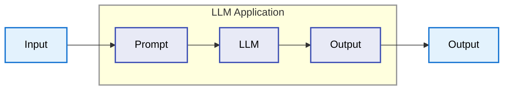
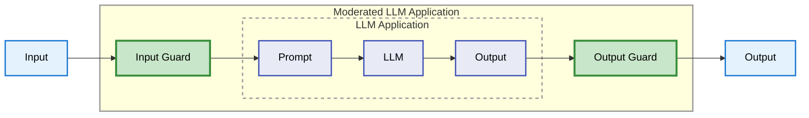

## Como evitar que el LLM se vaya a la banquina

---

# El Problema con los LLM

<div class="grid gap-8">

<v-click>

### Modelos estadísticos, no determinísticos

```python
prompt = "Suma 2 + 2"

response_1 = llm(prompt) # "4"
response_2 = llm(prompt) # "2 + 2 = 4"
response_3 = llm(prompt) # "La suma es cuatro"
```
</v-click>
<v-click>

### Pueden generar información que no es correcta
- Información desactualizada
- Responder a preguntas que no queremos

</v-click>
</div>

---
layout: image-right
image: ./images/hallucination_meme.png
backgroundSize: 20em 70%
---

# Hallucinations

Cuando el modelo genera contenido que:
- No es factualmente correcto
- Inventa referencias o datos
- Contradice la información proporcionada
- Parece confiable pero es falso

<div class="mt-6">

Inherente a la arquitectura de los LLMs

</div>

---

# Tasas de Alucinación
Benchmarks según Vectara Hallucination Leaderboard (Diciembre 2025) - Metodología HHEM-2.3

<div style="font-size: 9px; margin-top: 20px;">

<div style="display: flex; align-items: center; margin-bottom: 6px;">
  <div style="width: 150px;" class="text-sm">Gemini-2.5-Flash-Lite</div>
  <div style="flex: 1; background: #e0e0e0; height: 20px; border-radius: 2px;">
    <div style="width: 25.4%; background: #4caf50; height: 100%; border-radius: 2px; display: flex; align-items: center; justify-content: flex-end; padding-right: 6px; color: white; font-weight: 700;">3.3%</div>
  </div>
</div>

<div style="display: flex; align-items: center; margin-bottom: 6px;">
  <div style="width: 150px;" class="text-sm">DeepSeek-V3.2-Exp</div>
  <div style="flex: 1; background: #e0e0e0; height: 20px; border-radius: 2px;">
    <div style="width: 40.8%; background: #2196f3; height: 100%; border-radius: 2px; display: flex; align-items: center; justify-content: flex-end; padding-right: 6px; color: white; font-weight: 700;">5.3%</div>
  </div>
</div>

<div style="display: flex; align-items: center; margin-bottom: 6px;">
  <div style="width: 150px;" class="text-sm">DeepSeek-V3.1</div>
  <div style="flex: 1; background: #e0e0e0; height: 20px; border-radius: 2px;">
    <div style="width: 42.3%; background: #2196f3; height: 100%; border-radius: 2px; display: flex; align-items: center; justify-content: flex-end; padding-right: 6px; color: white; font-weight: 700;">5.5%</div>
  </div>
</div>

<div style="display: flex; align-items: center; margin-bottom: 6px;">
  <div style="width: 150px;" class="text-sm">GPT-4.1</div>
  <div style="flex: 1; background: #e0e0e0; height: 20px; border-radius: 2px;">
    <div style="width: 43.1%; background: #9c27b0; height: 100%; border-radius: 2px; display: flex; align-items: center; justify-content: flex-end; padding-right: 6px; color: white; font-weight: 700;">5.6%</div>
  </div>
</div>

<div style="display: flex; align-items: center; margin-bottom: 6px;">
  <div style="width: 150px;" class="text-sm">DeepSeek-V3</div>
  <div style="flex: 1; background: #e0e0e0; height: 20px; border-radius: 2px;">
    <div style="width: 47.0%; background: #2196f3; height: 100%; border-radius: 2px; display: flex; align-items: center; justify-content: flex-end; padding-right: 6px; color: white; font-weight: 700;">6.1%</div>
  </div>
</div>

<div style="display: flex; align-items: center; margin-bottom: 6px;">
  <div style="width: 150px;" class="text-sm">Gemini-2.5-Pro</div>
  <div style="flex: 1; background: #e0e0e0; height: 20px; border-radius: 2px;">
    <div style="width: 53.8%; background: #4caf50; height: 100%; border-radius: 2px; display: flex; align-items: center; justify-content: flex-end; padding-right: 6px; color: white; font-weight: 700;">7.0%</div>
  </div>
</div>

<div style="display: flex; align-items: center; margin-bottom: 6px;">
  <div style="width: 150px;" class="text-sm">Gemini-2.5-Flash</div>
  <div style="flex: 1; background: #e0e0e0; height: 20px; border-radius: 2px;">
    <div style="width: 60.0%; background: #4caf50; height: 100%; border-radius: 2px; display: flex; align-items: center; justify-content: flex-end; padding-right: 6px; color: white; font-weight: 700;">7.8%</div>
  </div>
</div>

<div style="display: flex; align-items: center; margin-bottom: 6px;">
  <div style="width: 150px;" class="text-sm">GPT-4o</div>
  <div style="flex: 1; background: #e0e0e0; height: 20px; border-radius: 2px;">
    <div style="width: 73.8%; background: #9c27b0; height: 100%; border-radius: 2px; display: flex; align-items: center; justify-content: flex-end; padding-right: 6px; color: white; font-weight: 700;">9.6%</div>
  </div>
</div>

<div style="display: flex; align-items: center; margin-bottom: 6px;">
  <div style="width: 150px;" class="text-sm">Claude-Haiku-4.5</div>
  <div style="flex: 1; background: #e0e0e0; height: 20px; border-radius: 2px;">
    <div style="width: 75.4%; background: #ff9800; height: 100%; border-radius: 2px; display: flex; align-items: center; justify-content: flex-end; padding-right: 6px; color: white; font-weight: 700;">9.8%</div>
  </div>
</div>

<div style="display: flex; align-items: center; margin-bottom: 6px;">
  <div style="width: 150px;" class="text-sm">Claude-Sonnet-4</div>
  <div style="flex: 1; background: #e0e0e0; height: 20px; border-radius: 2px;">
    <div style="width: 79.2%; background: #ff9800; height: 100%; border-radius: 2px; display: flex; align-items: center; justify-content: flex-end; padding-right: 6px; color: white; font-weight: 700;">10.3%</div>
  </div>
</div>

<div style="display: flex; align-items: center; margin-bottom: 6px;">
  <div style="width: 150px;" class="text-sm">GPT-5-Nano</div>
  <div style="flex: 1; background: #e0e0e0; height: 20px; border-radius: 2px;">
    <div style="width: 80.8%; background: #9c27b0; height: 100%; border-radius: 2px; display: flex; align-items: center; justify-content: flex-end; padding-right: 6px; color: white; font-weight: 700;">10.5%</div>
  </div>
</div>

<div style="display: flex; align-items: center; margin-bottom: 6px;">
  <div style="width: 150px;" class="text-sm">Claude-Opus-4.5</div>
  <div style="flex: 1; background: #e0e0e0; height: 20px; border-radius: 2px;">
    <div style="width: 83.8%; background: #ff9800; height: 100%; border-radius: 2px; display: flex; align-items: center; justify-content: flex-end; padding-right: 6px; color: white; font-weight: 700;">10.9%</div>
  </div>
</div>

<div style="display: flex; align-items: center; margin-bottom: 6px;">
  <div style="width: 150px;" class="text-sm">GPT-5.1-Low</div>
  <div style="flex: 1; background: #e0e0e0; height: 20px; border-radius: 2px;">
    <div style="width: 83.8%; background: #9c27b0; height: 100%; border-radius: 2px; display: flex; align-items: center; justify-content: flex-end; padding-right: 6px; color: white; font-weight: 700;">10.9%</div>
  </div>
</div>

<div style="display: flex; align-items: center; margin-bottom: 6px;">
  <div style="width: 150px;" class="text-sm">DeepSeek-R1</div>
  <div style="flex: 1; background: #e0e0e0; height: 20px; border-radius: 2px;">
    <div style="width: 87.0%; background: #2196f3; height: 100%; border-radius: 2px; display: flex; align-items: center; justify-content: flex-end; padding-right: 6px; color: white; font-weight: 700;">11.3%</div>
  </div>
</div>

<div style="display: flex; align-items: center; margin-bottom: 6px;">
  <div style="width: 150px;" class="text-sm">GPT-5.1-High</div>
  <div style="flex: 1; background: #e0e0e0; height: 20px; border-radius: 2px;">
    <div style="width: 93.1%; background: #9c27b0; height: 100%; border-radius: 2px; display: flex; align-items: center; justify-content: flex-end; padding-right: 6px; color: white; font-weight: 700;">12.1%</div>
  </div>
</div>

<div style="display: flex; align-items: center; margin-bottom: 6px;">
  <div style="width: 150px;" class="text-sm">GPT-5-Mini</div>
  <div style="flex: 1; background: #e0e0e0; height: 20px; border-radius: 2px;">
    <div style="width: 99.2%; background: #9c27b0; height: 100%; border-radius: 2px; display: flex; align-items: center; justify-content: flex-end; padding-right: 6px; color: white; font-weight: 700;">12.9%</div>
  </div>
</div>

</div>

---
layout: center
class: text-center
---

# ¿Por qué no basta con Prompt Engineering?

---
layout: image-right
image: ./images/prompt_injection_meme.png
backgroundSize: 45em 80%
---

# 🔓 OWASP LLM01:2025
## Prompt Injection

<blockquote cite="https://genai.owasp.org/llmrisk/llm01-prompt-injection/" class="mt-6">
  Prompt Injection vulnerabilities exist in how models process prompts, and how input may force the model to incorrectly pass prompt data to other parts of the model, potentially causing them to violate guidelines, generate harmful content, enable unauthorized access, or influence critical decisions. While techniques like Retrieval Augmented Generation (RAG) and fine-tuning aim to make LLM outputs more relevant and accurate, research shows that they do not fully mitigate prompt injection vulnerabilities.
</blockquote>

<blockquote cite="https://genai.owasp.org/llmrisk/llm01-prompt-injection/" class="mt-6">
  Prompt injection vulnerabilities are possible due to the nature of generative AI. Given the stochastic influence at the heart of the way models work, it is unclear if there are fool-proof methods of prevention for prompt injection
</blockquote>

---

# ¿Qué son los Guardrails?

<div>

Capas de **validación, filtrado y control** alrededor del LLM.

- ✅ **Validar** entradas antes del procesamiento
- ✅ **Filtrar** salidas antes de entregarlas al usuario
- ✅ **Detectar** contenido problemático
- ✅ **Redactar** información sensible (PII)
- ✅ **Verificar** adherencia a políticas
- ✅ **Monitorear** comportamiento en producción

</div>

<v-click>

<div class="mt-6 p-4 bg-blue-50 dark:bg-blue-900/20 rounded">
💡 No confiar en UNA sola capa de defensa
</div>

</v-click>

---

# Arquitectura de LLM con Guardrails

<div class='grid gap-12 mt-12'>
<v-click>
<div>

## Sin Guardrails



</div>
</v-click>

<v-click>
<div>

## Con Guardrails



</div>
</v-click>
</div>

---

# Layers

<div class="grid grid-cols-2 gap-4">
<div>

## 1️⃣ Input Layer

<div class="text-sm">

- **Sanitización** de caracteres especiales
- **Detección de PII** (datos personales)
- **Anti-injection patterns**
- **Topic validation** (temas prohibidos)
- **Rate limiting** por usuario

</div>
</div>

<div>
<v-click>

## 2️⃣ Processing Layer

<div class="text-sm">

- **Context management** (límites de ventana)
- **Policy enforcement** (reglas de negocio)
- **Token budgets** (límites de costo)
- **Retrieval filtering** (en RAG)

</div>
</v-click>
</div>


<div>
<v-click>

## 3️⃣ Output Layer

<div class="text-sm">

- **Hallucination detection**
- **PII redaction** (eliminar datos sensibles)
- **Bias detection** (fairness)
- **Completeness checks**

</div>
</v-click>
</div>

<div>
<v-click>

## 4️⃣ Monitoring Layer

<div class="text-sm">

- **Audit logging** (trazabilidad)
- **Anomaly detection** (patrones sospechosos)
- **Performance metrics**
- **Cost tracking**
- **Human-in-the-loop** para casos edge

</div>
</v-click>
</div>

</div>

---

# OpenAI: Moderation API

<div class="grid grid-cols-2 gap-8">

<div>

## Características (2024 Update)

- **Basada en GPT-4o**
- **Multimodal**: Texto + Imágenes
- **Gratuita** para todos los desarrolladores
- **Multilingüe** (mejor precisión en no-inglés)
- **Scores calibrados** de probabilidad

<div class="text-xs mt-4 opacity-60">
📖 Docs oficiales:<br/>
platform.openai.com/docs/guides/moderation
</div>

</div>

<div>

## Categorías de Contenido

<div class="text-sm">

### Hate Speech
- `hate`: Discriminación por raza, género, religión, etc.
- `hate/threatening`: Hate + amenazas de violencia

### Harassment
- `harassment`: Promoción de acoso
- `harassment/threatening`: Acoso + amenazas

### Self-Harm
- `self-harm`: Promoción de autolesión
- `self-harm/intent`: Intención declarada
- `self-harm/instructions`: Guías de autolesión

</div>

</div>

</div>

---

# Google Gemini: Safety Settings

<div class="grid grid-cols-2 gap-8">

<div>

## Harm Categories

4 categorías principales:

<div class="text-sm">

1. **Harassment** - Comentarios dañinos sobre identidad
2. **Hate Speech** - Contenido grosero/irrespetuoso
3. **Sexually Explicit** - Material sexual/lascivo
4. **Dangerous Content** - Promoción de actos dañinos

</div>

<div class="text-xs mt-4 opacity-60">
📖 Docs oficiales:<br/>
ai.google.dev/gemini-api/docs/safety-settings
</div>

<v-click>

<div class="text-sm mt-4">

### Niveles de Probabilidad

- **HIGH** - Alta probabilidad de no seguro
- **MEDIUM** - Probabilidad media
- **LOW** - Probabilidad baja
- **NEGLIGIBLE** - Probabilidad insignificante

⚠️ Se bloquea por **probabilidad**, no severidad

</div>

</v-click>

</div>

<div>

<v-click>

## Blocking Thresholds

<div class="text-sm">

5 niveles de configuración:

```python {text:xs}
BLOCK_NONE           # Permitir todo
BLOCK_ONLY_HIGH      # Solo alta probabilidad
BLOCK_MEDIUM_AND_ABOVE  # Media + alta
BLOCK_LOW_AND_ABOVE  # Baja + media + alta
OFF                  # Deshabilitado
```

</div>

</v-click>

<v-click>

<div class="text-sm mt-4">

## Severity Scores

- **Rango**: 0.0 → 1.0
- **Discretizado**: NEGLIGIBLE, LOW, MEDIUM, HIGH
- Refleja **magnitud del daño potencial**

</div>

</v-click>

<v-click>

<div class="text-sm mt-4">

### Protecciones Fijas

🔒 **Child safety** siempre bloqueado (no configurable)

</div>

</v-click>

</div>

</div>

---

# Google Gemini: Configuración en Código

```python {text:xs}
import google.generativeai as genai

safety_settings = [
    {
        "category": "HARM_CATEGORY_HARASSMENT",
        "threshold": "BLOCK_MEDIUM_AND_ABOVE"
    },
    {
        "category": "HARM_CATEGORY_HATE_SPEECH",
        "threshold": "BLOCK_MEDIUM_AND_ABOVE"
    },
    {
        "category": "HARM_CATEGORY_SEXUALLY_EXPLICIT",
        "threshold": "BLOCK_LOW_AND_ABOVE"  # Más restrictivo
    },
    {
        "category": "HARM_CATEGORY_DANGEROUS_CONTENT",
        "threshold": "BLOCK_ONLY_HIGH"  # Menos restrictivo
    }
]

model = genai.GenerativeModel('gemini-pro')
response = model.generate_content(
    "Tu prompt aquí",
    safety_settings=safety_settings
)

# Verificar si fue bloqueado
if response.prompt_feedback.block_reason:
    print(f"Bloqueado: {response.prompt_feedback.block_reason}")
```

<div class="text-xs mt-4 opacity-60">
💡 Ajustable por request vía API o Google AI Studio
</div>

---

# Anthropic Claude: Constitutional AI

<div class="grid grid-cols-2 gap-8">

<div>

## Enfoque: Constitutional AI (CAI)

Embedding de una **"constitución"** (principios) directamente en el entrenamiento:

✅ **Menos dependiente** de human feedback
✅ **Values-aligned** desde el training
✅ **Resistente a jailbreaking** por diseño

<v-click>

<div class="text-sm mt-4">

### Cinco Dimensiones de Harm

1. **Physical** - Daño físico
2. **Psychological** - Daño mental/emocional
3. **Economic** - Daño financiero
4. **Societal** - Daño social/comunitario
5. **Individual Autonomy** - Restricción de libertad

</div>

</v-click>

<div class="text-xs mt-4 opacity-60">
📖 Docs oficiales:<br/>
platform.claude.com/docs/test-and-evaluate/strengthen-guardrails
</div>

</div>

<div>

<v-click>

## Resistencia a Jailbreaking

**Claude es significativamente más resistente** que otros LLMs:

- Defendido contra **miles de horas** de red teaming
- Constitutional AI proporciona resiliencia core
- Menor tasa de bypass exitoso

</v-click>

</div>

</div>

---

# Anthropic Claude: Estrategias Adicionales

<div class="grid grid-cols-2 gap-8">

<div>

## Estrategias Recomendadas

<div class="text-sm">

1. **Harmlessness Screening** (Claude Haiku para pre-filtrado)
2. **Input Validation** (patrones de jailbreak)
3. **Prompt Engineering** (énfasis en ética/compliance)
4. **User Behavior Monitoring** (patrones de abuso)
5. **Continuous Monitoring** (análisis de outputs)
6. **Layered Approach** (múltiples safeguards)

</div>

</div>

<div>

## Equipo de Safeguards

<div class="text-sm">

**Policy Development**
- Usage Policy framework
- Policy Vulnerability Testing

**Real-Time Enforcement**
- AI-powered classifiers
- Response steering
- Account-level enforcement

**Ongoing Monitoring**
- Hierarchical summarization
- Public threat intelligence sharing

</div>

<div class="text-xs mt-4 opacity-60">
📄 anthropic.com/news/building-safeguards-for-claude
</div>

</div>

</div>

---

# Key Takeaways

## 🎯 Conceptos Clave

1. **Los LLMs alucinan** - es inherente a la arquitectura
   - Tasas mejoraron 96% (2021→2025)
   - Varían por dominio (0.7% general vs 76% finanzas)

2. **Prompts no bastan** - necesitamos guardrails
   - Prompt injection = riesgo #1 (OWASP)
   - No existe solución definitiva

3. **Defense in Depth** - múltiples capas
   - Input, Processing, Output, Monitoring

4. **Safety mechanisms de vendors** - usar + extender
   - OpenAI: Moderation API (gratis, multimodal)
   - Gemini: Safety Settings (configurable)
   - Claude: Constitutional AI (jailbreak-resistant)

---

# Casos Legales y de Seguridad

<div class="grid grid-cols-2 gap-8 text-xs">

<div>

## Casos Legales

**Moffatt v. Air Canada (2024 BCCRT 149)**
- Chatbot dio información incorrecta
- Empresa responsable legalmente
- Daños: $812.02 CAD
- Precedente: "chatbot no es entidad legal separada"

**Steven Schwartz (New York)**
- Citó 6 casos falsos de ChatGPT
- Multa: $5,000
- Impacto en responsabilidad profesional

**Michael Cohen**
- 3 casos inventados por Google Bard
- Casos completamente fabricados
- Consecuencias legales

</div>

<div>

## Incidentes de Seguridad (2024-2025)

**Flowise CVE-2024-31621**
- 438 servidores LLM comprometidos
- Leak de datos sensibles

**Samsung ChatGPT Leak**
- Código fuente de semiconductores
- Información confidencial

**LLM Hijacking Attacks**
- Costos hasta $100,000/día
- Unit 42 (Palo Alto Networks) research

**OmniGPT Breach (Feb 2025)**
- 30,000+ usuarios afectados
- API keys, billing data expuestos
- Personal info leaked

</div>

</div>

---
layout: center
class: text-center
---

# Gracias!
